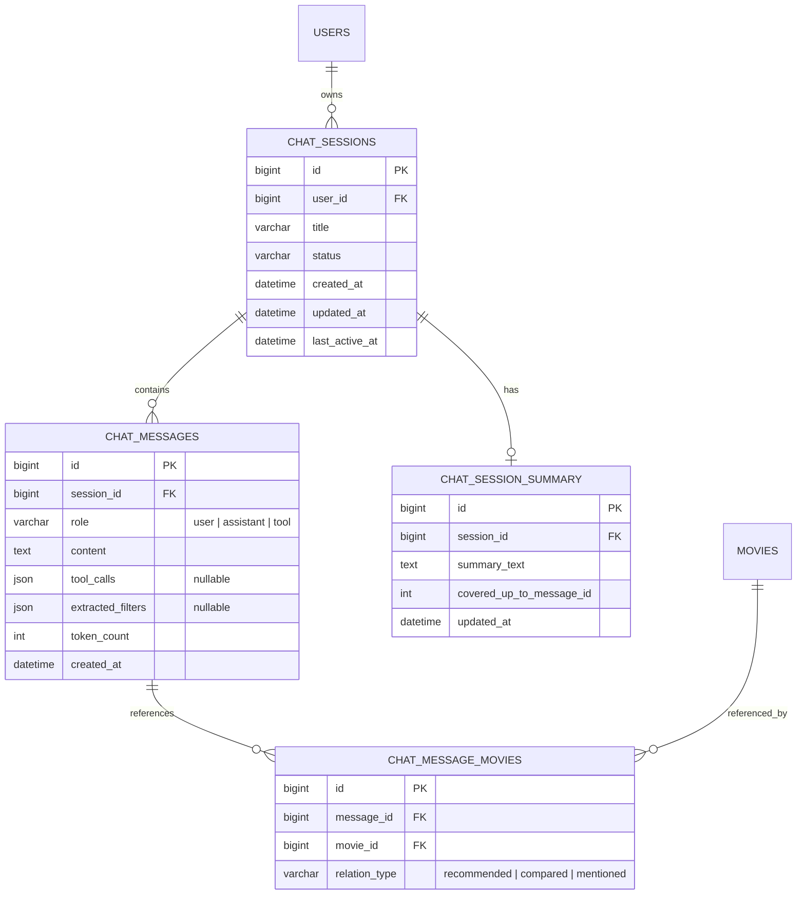
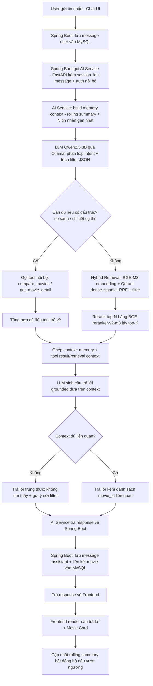

**Phần việc:** Khảo sát Ollama và mô hình Qwen2.5 3B, thiết kế use case cho hệ thống RAG, thiết kế mô hình bộ nhớ hội thoại (conversation-memory model), thiết kế luồng hoạt động của chatbot.

**Phạm vi đã chốt:** RAG-first + tool integration (không dùng LangGraph/agent framework phức tạp ở MVP); LLM phục vụ qua Ollama chạy host ở giai đoạn đầu, container hoá bằng Docker khi ổn định; conversation memory theo chiến lược "summary + recent messages" — đúng theo scope đã chốt trong blueprint dự án.

---

## 1. Khảo sát Ollama và Qwen2.5 3B

Ollama là runtime mã nguồn mở đóng gói, tải và phục vụ (serve) LLM ngay trên máy cục bộ, expose qua HTTP API tương thích OpenAI-style (`/api/generate`, `/api/chat`, cổng mặc định `11434`). Model được đóng gói dưới dạng "Modelfile", cho phép pull/run bằng một dòng lệnh (`ollama pull qwen2.5:3b`), cấu hình tham số suy luận (`num_ctx`, `temperature`), và hỗ trợ sẵn quantization (Q4_K_M, Q5_K_M, Q8_0, BF16) cùng **tool calling** và **structured output** — hai tính năng bắt buộc cho kiến trúc RAG-first + tool integration của dự án.

Khảo sát thông số kỹ thuật Qwen2.5-3B (Alibaba Qwen team, phát hành tháng 9/2024):

| Thuộc tính | Giá trị |
| :--- | :--- |
| Số tham số | ~3.09B tổng, dense (không phải MoE) |
| Kiến trúc | Causal Transformer, 36 layers, Grouped-Query Attention (16 Q-head / 2 KV-head) |
| Context window | 32.768 token |
| Chế độ suy luận | Hỗ trợ tốt system prompt phức tạp, trích xuất JSON và Tool/Function Calling |
| Ngôn ngữ | Hỗ trợ đa ngôn ngữ xuất sắc (29+ ngôn ngữ), tiếng Việt rất tự nhiên |
| License | Apache 2.0 — không giới hạn thương mại |
| Nền tảng deploy | Ollama, vLLM, SGLang, llama.cpp, Transformers |

**Kết quả đánh giá:**

- Structured output (JSON cho filter/tool call): đáp ứng rất tốt, cần ràng buộc bằng system prompt + JSON schema hoặc tính năng `format: json` của Ollama.
- Grounding theo context truy hồi: cần prompt engineering kỹ (chỉ trả lời dựa trên context, có cơ chế "không tìm thấy thì nói không biết") để giảm hallucination — đưa vào bộ evaluation Tuần 7.
- Conversation memory dài: context 32K đủ cho vài chục lượt hội thoại + top-K context phim, nhưng vẫn cần chiến lược tóm tắt (mục 3) để tránh phình ngữ cảnh và giảm độ trễ.
- Tốc độ trên phần cứng cá nhân: bản quant Q4_K_M (chỉ tốn ~2.0 - 2.2 GB RAM/VRAM) chạy real-time với tốc độ sinh token rất cao trên GPU tầm trung hoặc CPU hiện đại — cực kỳ phù hợp cho môi trường dev và demo.
- Fine-tuning (nhánh nâng cao): kích thước 3B rất nhẹ, hoàn toàn khả thi để chạy LoRA/QLoRA SFT mượt mà trên Colab/Kaggle (free-tier GPU), đúng kế hoạch Tuần 5–6.

**Rủi ro cần theo dõi:** Dù Qwen2.5 3B rất thông minh, độ chính xác khi trích xuất các filter phức tạp từ ngôn ngữ tự nhiên → JSON có thể đôi khi bị trượt format; bắt buộc cần vài few-shot examples trong system prompt và một fallback rule-based parser ở code backend khi JSON không hợp lệ.

---

## 2. Thiết kế Use Case cho hệ thống RAG

Mở rộng chi tiết UC13 (Trò chuyện với AI Chatbot) và UC15 (So sánh phim) trong bảng use case tổng hợp của dự án, dành riêng cho phần RAG/chatbot — 10 use case:

| ID | Tên Use Case | Actor | Mô tả |
| :--- | :--- | :--- | :--- |
| RAG-01 | Đặt câu hỏi tìm phim bằng ngôn ngữ tự nhiên | User | Nhập câu hỏi tự nhiên → hệ thống trích xuất filter + truy hồi + sinh câu trả lời kèm movie card |
| RAG-02 | Trích xuất filter từ ngôn ngữ tự nhiên | AI Chatbot | Parse genre/year/rating/country/language/director/actor thành JSON filter hợp lệ cho Qdrant payload filter |
| RAG-03 | Truy hồi ngữ cảnh (retrieval) | AI Chatbot | Hybrid search (dense + sparse + RRF) trên Qdrant, lấy top-K phim liên quan làm context |
| RAG-04 | Sinh câu trả lời có căn cứ | AI Chatbot | LLM sinh câu trả lời chỉ dựa trên context truy hồi được, kèm trích dẫn phim cụ thể |
| RAG-05 | Duy trì ngữ cảnh hội thoại nhiều lượt | User / AI Chatbot | Nhớ các lượt trước nhờ conversation memory |
| RAG-06 | Gọi tool so sánh phim (`compare_movies`) | AI Chatbot | User yêu cầu so sánh 2+ phim → gọi tool nội bộ, tổng hợp trả lời |
| RAG-07 | Gọi tool chi tiết phim (`get_movie_detail`) | AI Chatbot | Context không đủ → gọi tool truy vấn trực tiếp MySQL/Qdrant thay vì chỉ dựa retrieval ngữ nghĩa |
| RAG-08 | Xử lý không tìm thấy kết quả phù hợp | User / AI Chatbot | Retrieval không đạt ngưỡng liên quan → trả lời trung thực, gợi ý nới lỏng filter |
| RAG-09 | Gợi ý phim kèm giải thích trong hội thoại | User / AI Chatbot | Lồng ghép recommendation cá nhân hóa (UC11/UC12) khi phù hợp ngữ cảnh |
| RAG-10 | Reset / bắt đầu phiên hội thoại mới | User | Xoá lịch sử phiên hiện tại, tránh nhiễu ngữ cảnh cũ |

**Luồng chính (RAG-01, happy path):**

1. User nhập tin nhắn tự nhiên vào Chat UI.
2. Spring Boot lưu tin nhắn user vào MySQL, forward request kèm `session_id` sang AI Service (FastAPI).
3. AI Service (RAG-02) trích xuất intent + filter JSON bằng LLM (structured output).
4. AI Service (RAG-03) gọi Qdrant hybrid search với filter → top-N ứng viên → rerank (BGE-reranker-v2-m3) → top-K context.
5. Ghép context + lịch sử hội thoại rút gọn vào prompt, gọi Qwen2.5 3B qua Ollama (RAG-04).
6. Nếu cần dữ liệu có cấu trúc (so sánh, chi tiết) → gọi tool tương ứng (RAG-06/RAG-07) trước khi sinh câu trả lời cuối.
7. AI Service trả về câu trả lời + danh sách `movie_id` liên quan + metadata.
8. Spring Boot lưu phản hồi bot, trả về Frontend.
9. Frontend hiển thị câu trả lời + movie card.

**Điều kiện ngoại lệ:**

- Không có kết quả retrieval đạt ngưỡng similarity → thực hiện RAG-08.
- LLM trả JSON không hợp lệ khi trích filter → fallback dùng dense/sparse retrieval thuần ngữ nghĩa, log lỗi để cải thiện prompt.
- Timeout Ollama → trả thông báo lỗi thân thiện, không chặn toàn bộ luồng chat.
- Session hết hạn/không tồn tại → tự tạo session mới.

---

## 3. Thiết kế mô hình bộ nhớ hội thoại (Conversation-Memory Model)

Áp dụng chiến lược **"summary + recent messages"** (đã chốt trong scope dự án — Backlog Nam Anh):

- Giữ nguyên văn N tin nhắn gần nhất (N = 6–10, tương đương 3–5 lượt hỏi-đáp) để đảm bảo mạch hội thoại tự nhiên.
- Tin nhắn cũ hơn được tóm tắt định kỳ (rolling summary) bằng chính LLM thành đoạn ngắn (200–400 token), lưu trong bảng riêng.
- Build prompt theo thứ tự: `system_prompt + rolling_summary + N tin nhắn gần nhất + context retrieval + câu hỏi hiện tại`.
- Mục tiêu: giữ prompt an toàn dưới ~8–12K token (dù model hỗ trợ 32K) để giảm độ trễ tối đa trên phần cứng cá nhân.

**Lược đồ dữ liệu (MySQL, quản lý qua Spring Boot — Tuần 5):**

**Kết quả (vai trò từng bảng):**

- `chat_sessions`: một phiên hội thoại của user; `status` (active/archived) phục vụ RAG-10.
- `chat_messages`: lưu từng lượt tin nhắn; `extracted_filters` phục vụ evaluation filter-extraction F1 (Tuần 7); `tool_calls` phục vụ audit khi gọi tool.
- `chat_session_summary`: bản tóm tắt luỹ tiến; `covered_up_to_message_id` đánh dấu đã tóm tắt đến đâu để tránh tóm tắt trùng.
- `chat_message_movies`: bảng liên kết N-N giữa tin nhắn và phim, phục vụ hiển thị movie card đúng ngữ cảnh và explainability.

**Chiến lược cập nhật (pseudo-flow):** mỗi tin nhắn mới → đếm số tin nhắn chưa tóm tắt → nếu vượt ngưỡng (ví dụ 10) → LLM tóm tắt đoạn cũ (giữ nguyên N tin nhắn gần nhất) → update `chat_session_summary` → build context = `summary_text` mới nhất + N tin nhắn gần nhất theo `created_at DESC LIMIT N`. Việc tóm tắt chạy **bất đồng bộ** để không tăng độ trễ trả lời.

---

## 4. Thiết kế luồng hoạt động của Chatbot (Chatbot Flow)

**Diễn giải các bước chính:**

| Bước | Thành phần | Chi tiết kỹ thuật |
| :--- | :--- | :--- |
| Nhận & lưu tin nhắn | Spring Boot | Xác thực JWT, validate input, lưu vào `chat_messages` (role=user) |
| Điều phối sang AI Service | Spring Boot → FastAPI | Internal AI authentication (Tuần 6), truyền `session_id`, nội dung, `user_id` |
| Build memory context | AI Service | Lấy `chat_session_summary` + N tin nhắn gần nhất |
| Intent + filter extraction | AI Service + Qwen2.5 3B | Output JSON `{intent, filters, needs_tool}`; có few-shot ví dụ để tăng độ chính xác |
| Tool routing | AI Service | `needs_tool = compare` → `compare_movies(movie_ids)`; cần chi tiết cụ thể → `get_movie_detail(movie_id)` |
| Retrieval | AI Service | Hybrid search dense + sparse + RRF trên Qdrant, áp payload filter |
| Reranking | AI Service | BGE-reranker-v2-m3 sắp xếp lại top-N → chọn top-K |
| Grounded generation | Qwen2.5 3B (Ollama) | Chỉ dùng thông tin trong context được cung cấp; không đủ căn cứ → nói rõ không tìm thấy |
| Kiểm tra độ liên quan | AI Service | So khớp similarity/rerank score với ngưỡng; dưới ngưỡng → nhánh RAG-08 |
| Trả kết quả | AI Service → Spring Boot | `{answer_text, movie_ids[], tool_used, filters_used}` |
| Lưu & liên kết | Spring Boot | Lưu message assistant, ghi `chat_message_movies` |
| Cập nhật bộ nhớ | AI Service (async) | Trigger tóm tắt nếu vượt ngưỡng tin nhắn, không chặn response chính |

**Nhận xét:** pipeline tách rõ 2 nhánh (tool calling có cấu trúc vs. retrieval ngữ nghĩa) trước khi hợp nhất tại bước ghép context — giúp tránh việc ép LLM tự "đoán" dữ liệu có cấu trúc (như so sánh số liệu) chỉ từ context bán cấu trúc của retrieval, giảm rủi ro hallucination ở các câu hỏi cần độ chính xác cao.

---

## Tổng kết

Cả 4 nhiệm vụ Tuần 1 đã hoàn thành. Điểm cần mang sang các tuần sau:

- Tuần 2: dựng khung `/chat` interface + RAG baseline (chưa có tool calling, chưa có memory tóm tắt) để có pipeline chạy end-to-end sớm.
- Tuần 4–5: tích hợp retrieval endpoint thật vào RAG, thêm context builder, thêm tool call `compare_movies`.
- Tuần 6: hoàn thiện conversation memory persistence qua Spring Boot API, internal AI authentication, tích hợp model fine-tuned nếu benchmark tốt hơn base.
- Tuần 7: đánh giá theo 4 tiêu chí — answer faithfulness/relevance, filter extraction F1, memory continuity, so sánh Base Qwen2.5 3B vs Fine-tuned 3B.
- Rủi ro filter-extraction JSON ở model 3B (mục 1) cần theo dõi song song với evaluation Tuần 7.